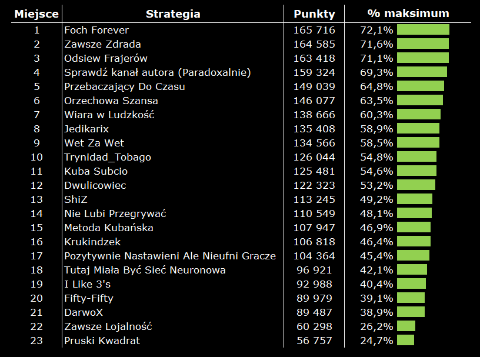
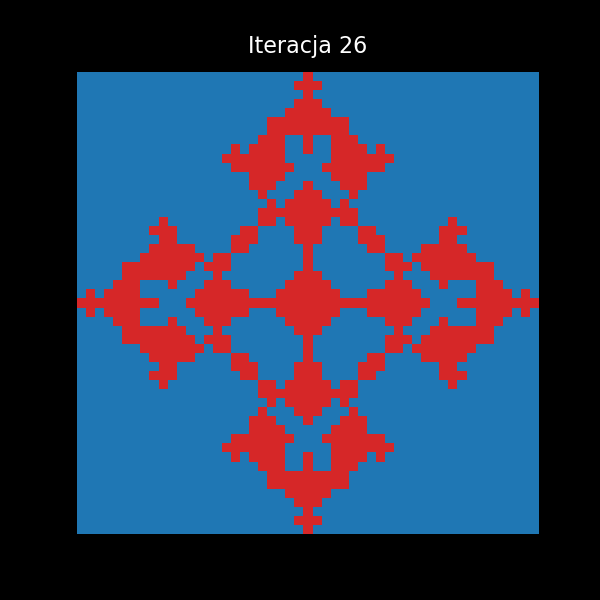

# Iterated Prisoner’s Dilemma – Tournament and Spatial Models

## What

This repository contains Python implementations of the Iterated Prisoner’s Dilemma in two complementary settings:

1. **Axelrod-style round-robin tournament**  
2. **Spatial (grid-based) evolutionary model**

It includes strategies such as:

- Always Cooperate  
- Always Defect  
- Tit-for-Tat  
- Grim Trigger  
- 50/50
- others  

The project allows configurable payoff matrices, evolutionary rules, and initial population structures.

---

## How

### Axelrod Tournament

The tournament module simulates repeated pairwise interactions between all strategies over a fixed number of rounds. For each pair:

- Iterated interactions are played
- Payoffs are accumulated
- Final scores are aggregated
- Strategies are ranked by total performance

This reproduces the logic of Robert Axelrod’s original computational experiments on the evolution of cooperation in well-mixed populations.

---

### Spatial Model

The spatial module embeds agents on a two-dimensional lattice. Each agent:

- Interacts locally with its neighbors  
- Accumulates payoffs  
- Updates its strategy according to a specified evolutionary rule  

The simulation supports:

- Custom grid initialization schemes  
- Multiple strategies coexisting simultaneously  
- Frame-by-frame visualization  
- Rendering animations (e.g., MP4) from saved iterations  

This enables analysis of spatiotemporal dynamics of cooperation and defection.

---

## Why

The purpose of this repository is to provide a computational framework for studying:

- The emergence of cooperation  
- The stability of cooperative behavior  
- The impact of strategy design  
- The role of population structure  

By combining well-mixed tournaments with spatially structured interactions, the project enables systematic comparison of global versus local evolutionary dynamics and highlights how interaction topology influences long-run strategic outcomes.
